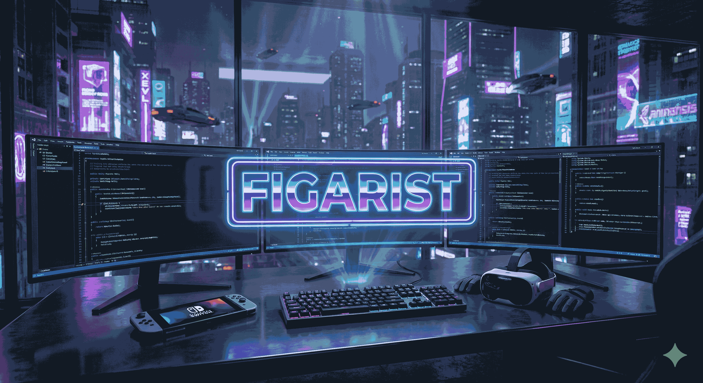
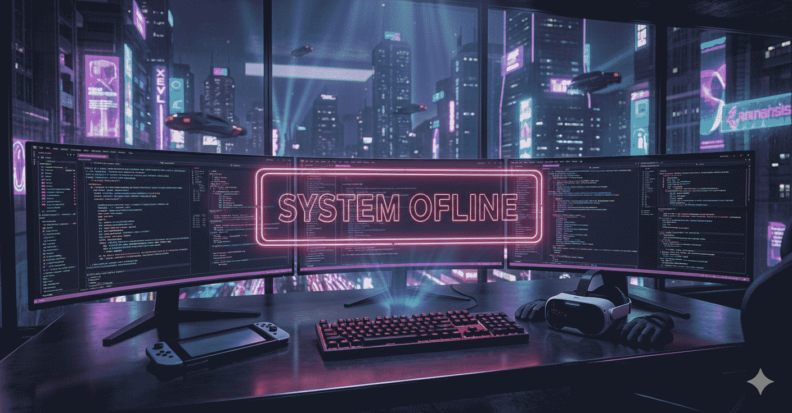

<div align="center">
  
</div>

<div align="center">
  
</div>

<br/>

<div align="center">
  
  [](https://discordapp.com/users/201598908030386176)
  [](https://www.facebook.com/Figarist/)
  [](https://www.instagram.com/figarist.xom/)
  [](https://www.threads.com/@figarist.xom)
  [](https://steamcommunity.com/id/figaristo/)
  [](https://open.spotify.com/user/lxw74ycexoku13aass8t92lp9)
</div>

<br/>

## 🌆 𝙰𝚋𝚘𝚞𝚝 𝙼𝚎

```typescript
const figarist = {
    location: "Kharkiv, Ukraine UA",
    age: 27,
    role: "Unity Developer & Computer Science Tutor",
    passion: "Creating immersive games and teaching the next generation",
    
    focus: {
        vr: "High-performance VR experiences",
        mobile: "Android & Wear OS development",
        architecture: "Clean code & OOP principles",
        methodology: "Spec-Driven Development"
    },
    
    geekLife: {
        gaming: ["Nintendo Switch", "Nintendo DS", "Physical Game Collector"],
        hobbies: ["Pokémon TCG", "Pokémon games", "LEGO", "Sonic Series", "Handhelds", "Rare games"],
        media: ["4K Cinema", "Racing Games", "Rhythm Games", "Geek Games"],
        interests: ["Puzzles", "Heavy Metal","Music Production", "Tech Automation", "Switch 2 Hype! 🎮"]
    }
};
```

<br/>

## 🎵 𝙲𝚞𝚛𝚛𝚎𝚗𝚝𝚕𝚢 𝚅𝚒𝚋𝚒𝚗𝚐 𝚃𝚘
<br/>
<p align="center">
  <a href="https://github.com/kittinan/spotify-github-profile">
    
  </a>
</p>

## 💻 𝚃𝚎𝚌𝚑 𝙰𝚛𝚜𝚎𝚗𝚊𝚕

<div align="center">

### 🛠️ 𝙳𝚎𝚟 𝙴𝚗𝚟𝚒𝚛𝚘𝚗𝚖𝚎𝚗𝚝

<table>
<tr>
<td align="center">


<br>


</td>
</tr>
</table>

<br>

### 🎮 𝙷𝚊𝚕𝚕 𝚘𝚏 𝙵𝚊𝚖𝚎

<table>
<tr>
<td align="center">


</td>
</tr>
</table>

<br>

### ⚙️ 𝙱𝚊𝚝𝚝𝚕𝚎 𝚂𝚝𝚊𝚝𝚒𝚘𝚗

<table>
<tr><th>🖥️ Core</th><th>🖱️ Peripherals</th><th>🎮 Extras</th></tr>
<tr>
<td align="center">


</td>
<td align="center">


</td>
<td align="center">


</td>
</tr>
</table>

</div>

## 📊 𝙶𝚒𝚝𝙷𝚞𝚋 𝙰𝚗𝚊𝚕𝚢𝚝𝚒𝚌𝚜

<div align="center">

<table width="100%">
<tr>
<td valign="top">


</td>
</tr>
</table>

</div>

</div>


## ⏱️ 𝚆𝚊𝚔𝚊𝚃𝚒𝚖𝚎 𝙲𝚘𝚍𝚒𝚗𝚐 𝚂𝚝𝚊𝚝𝚜

<div align="center">

<!--START_SECTION:waka-->
**I'm an Early 🐤** 

```text
🌞 Morning                111 commits         █████████░░░░░░░░░░░░░░░░   34.47 % 
🌆 Daytime                148 commits         ███████████░░░░░░░░░░░░░░   45.96 % 
🌃 Evening                63 commits          █████░░░░░░░░░░░░░░░░░░░░   19.57 % 
🌙 Night                  0 commits           ░░░░░░░░░░░░░░░░░░░░░░░░░   00.00 % 
```
📅 **I'm Most Productive on Friday** 

```text
Monday                   28 commits          ██░░░░░░░░░░░░░░░░░░░░░░░   08.70 % 
Tuesday                  46 commits          ████░░░░░░░░░░░░░░░░░░░░░   14.29 % 
Wednesday                15 commits          █░░░░░░░░░░░░░░░░░░░░░░░░   04.66 % 
Thursday                 33 commits          ███░░░░░░░░░░░░░░░░░░░░░░   10.25 % 
Friday                   89 commits          ███████░░░░░░░░░░░░░░░░░░   27.64 % 
Saturday                 58 commits          █████░░░░░░░░░░░░░░░░░░░░   18.01 % 
Sunday                   53 commits          ████░░░░░░░░░░░░░░░░░░░░░   16.46 % 
```


📊 **This Week I Spent My Time On** 

```text
💬 Programming Languages: 
Other                    22 hrs 51 mins      ████████████████████████░   95.94 % 
C#                       24 mins             ░░░░░░░░░░░░░░░░░░░░░░░░░   01.68 % 
Markdown                 21 mins             ░░░░░░░░░░░░░░░░░░░░░░░░░   01.49 % 
Io                       7 mins              ░░░░░░░░░░░░░░░░░░░░░░░░░   00.52 % 
Unity3D Asset            2 mins              ░░░░░░░░░░░░░░░░░░░░░░░░░   00.20 % 
```

**I Mostly Code in C#** 

```text
C#                       33 repos            ██████████████░░░░░░░░░░░   55.00 % 
ShaderLab                18 repos            ████████░░░░░░░░░░░░░░░░░   30.00 % 
HTML                     3 repos             █░░░░░░░░░░░░░░░░░░░░░░░░   05.00 % 
C++                      1 repo              ░░░░░░░░░░░░░░░░░░░░░░░░░   01.67 % 
Mathematica              1 repo              ░░░░░░░░░░░░░░░░░░░░░░░░░   01.67 % 
```


 Last Updated on 22/02/2026 01:30:01 UTC
<!--END_SECTION:waka-->

</div>

<br/>

## 🐍 𝙲𝚘𝚗𝚝𝚛𝚒𝚋𝚞𝚝𝚒𝚘𝚗 𝙰𝚌𝚝𝚒𝚟𝚒𝚝𝚢

<div align="center">
  <picture>
    <source media="(prefers-color-scheme: dark)" srcset="https://raw.githubusercontent.com/Figarist/Figarist/output/github-contribution-grid-snake-dark.svg">
    <source media="(prefers-color-scheme: light)" srcset="https://raw.githubusercontent.com/Figarist/Figarist/output/github-contribution-grid-snake.svg">
    
  </picture>
</div>


<br/>

## 💜 𝚂𝚞𝚙𝚙𝚘𝚛𝚝 𝙼𝚢 𝚆𝚘𝚛𝚔

<div align="center">
  
  ### 𝙸𝚏 𝚢𝚘𝚞 𝚎𝚗𝚓𝚘𝚢 𝚖𝚢 𝚙𝚛𝚘𝚓𝚎𝚌𝚝𝚜, 𝚌𝚘𝚗𝚜𝚒𝚍𝚎𝚛 𝚜𝚞𝚙𝚙𝚘𝚛𝚝𝚒𝚗𝚐 𝚖𝚎! ☕
  
  [](https://buymeacoffee.com/figarist)
  [](https://www.patreon.com/cw/figarist)
  [](https://ko-fi.com/figarist)
  
</div>

<br/>
<br/>

<div align="center">
  
</div>

<div align="center">
  
  
  
  <br/>
  
  **💜 𝙼𝚊𝚍𝚎 𝚠𝚒𝚝𝚑 𝚙𝚊𝚜𝚜𝚒𝚘𝚗 𝚋𝚢 𝙵𝚒𝚐𝚊𝚛𝚒𝚜𝚝 | 𝙴𝚜𝚝. 𝟸𝟶𝟸𝟼 💜**

  <sub>𝙲𝚘𝚍𝚒𝚗𝚐, 𝙶𝚊𝚖𝚒𝚗𝚐 & 𝚅𝚒𝚋𝚒𝚗𝚐 🎮🎵✨</sub>
  
</div>
